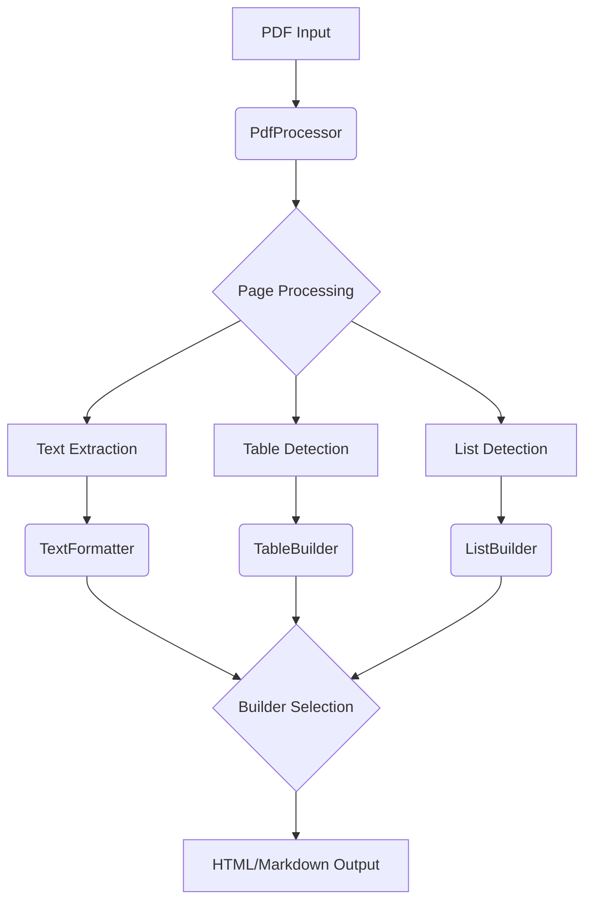
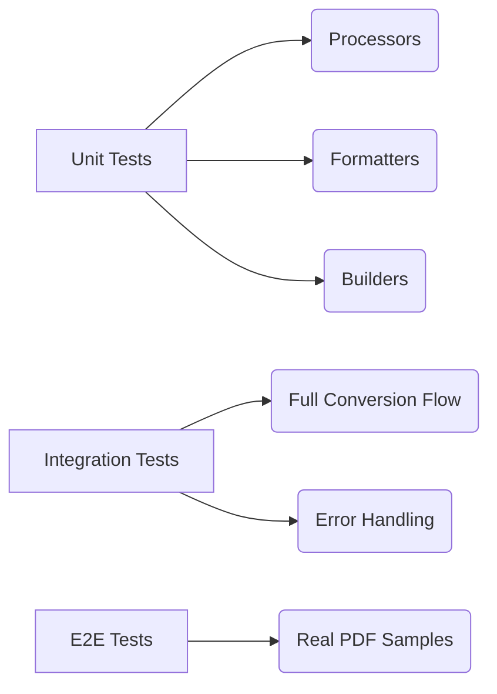

# PDF Converter Architecture

## Visão Geral
Este documento descreve a arquitetura do sistema de conversão PDF, seguindo princípios de Clean Architecture e SOLID. O sistema é composto por componentes modulares que permitem extensão para novos formatos de saída e processamento customizado.


## Princípios Chave
1. **Separação de Responsabilidades**: Cada componente tem uma única responsabilidade bem definida
2. **Baixo Acoplamento**: Componentes comunicam-se via interfaces abstratas
3. **Extensibilidade**: Novos formatos de saída podem ser adicionados sem modificar o núcleo
4. **Testabilidade**: Componentes isolados permitem testes unitários focados

## Estrutura de Diretórios
```
src/
├── core/ # Componentes centrais e contratos
├── processors/ # Implementações de processamento PDF
├── formatters/ # Conversão de elementos para formatos específicos
├── builders/ # Construtores de documentos completos
├── detectors/ # Detectores de elementos especiais
├── handlers/ # Manipulação de I/O e arquivos
└── services/ # Serviços de coordenação de alto nível
````


## Componentes Principais

### 1. PDF Processor (`processors/`)
- **Responsabilidade**: Extração de conteúdo estruturado do PDF
- **Componentes**:
  - `PdfProcessor`: Orquestra o processamento de páginas
  - `PageProcessor`: Processa elementos individuais da página

### 2. Formatters (`formatters/`)
- **Responsabilidade**: Conversão de elementos para formatos específicos
- **Componentes**:
  - `HtmlFormatter`: Composição de elementos HTML
  - `MarkdownFormatter`: Geração de sintaxe Markdown

### 3. Builders (`builders/`)
- **Responsabilidade**: Construção de documentos completos
- **Componentes**:
  - `HtmlBuilder`: Montagem de HTML com CSS posicional
  - `MarkdownBuilder`: Geração de documentos Markdown estruturados

### 4. Detectors (`detectors/`)
- **Responsabilidade**: Identificação de elementos especiais
- **Componentes**:
  - `ListDetector`: Detecção de listas ordenadas/não ordenadas
  - `TableDetector`: Identificação de estruturas tabulares
  
## Fluxo de Dados


## Extensibilidade
### Adicionar Novo Formato (ex: LaTeX)

- Criar novos componentes em formatters/latex_formatter.py
- Implementar LatexBuilder em builders/
- Registrar novo builder no ConverterFactory
- Adicionar testes em tests/formatters/test_latex_formatter.py
- Modificar Processamento de Texto
- Estender TextProcessor em processors/text/
- Implementar nova lógica de normalização
- Atualizar dependências via DI
- Manter compatibilidade com interfaces existentes


## Estratégia de Testes



## Roadmap
- Implementar suporte para imagens
- Adicionar conversão para PDF/A
- Criar interface gráfica web
- Adicionar suporte a templates HTML customizáveis

